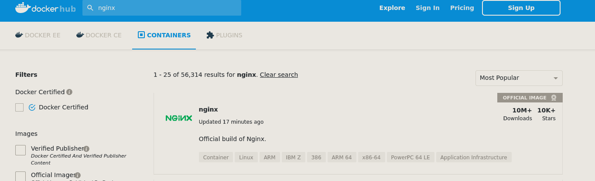

# Docker


---

## O que é um container?

Isolamento da aplicação e suas dependências


<style>
img {
  width: 48%;
  float: left;
}
</style>


---

## Container é igual VM? 


<style>
img {
 width: 48%;
}
</style>
---

## O que é Docker?

Tem sua origem na dotCloud, sendo somente wrapper em cima do LXC.

Open source em 2013.

dotCloud se torna Docker.

---

### Instalação no GNU/Linux

```shell
$ curl -fsSl https://get.docker.com | bash
```

---

### Obtendo uma imagem de container

```
docker pull nginx:alpine

docker image ls
```

|REPOSITORY          |TAG                 |IMAGE ID            |CREATED             |SIZE  |
|--------------------|--------------------|--------------------|--------------------|------|
|nginx               |alpine              |48c8a7c47625        |5 weeks ago         |21.8MB|

---

### De onde vem nginx:alpine?



<style>
img {
  width: 100%;
}
</style>


---

### Como são geradas?

```yaml
  FROM alpine:3.10

  LABEL maintainer="NGINX Docker Maintainers <docker-maint@nginx.com>"

  ENV NGINX_VERSION 1.17.8
  ENV NJS_VERSION   0.3.8
  ENV PKG_RELEASE   1
  RUN set -x \
	  && addgroup -g 101 -S nginx \
	  && adduser -S -D -H -u 101 -h /var/cache/nginx -s /sbin/nologin -G nginx -g nginx nginx \
	  && apk add nginx

  EXPOSE 80

  STOPSIGNAL SIGTERM

  CMD ["nginx", "-g", "daemon off;"]
```


---

### Build

```shell
docker build -f Dockerfile -t doContra/nginx:latest
```

---

### Rodando o nginx

```shell
docker run \
    --tty \
    --interactive \
    --rm \
    nginx:alpine
```


---

### Container em execução
```shell
docker container ps
```
    CONTAINER ID IMAGE        COMMAND                  CREATED       STATUS       PORTS  NAMES
    c2d3a8c608c4 nginx:alpine "nginx -g 'daemon of…"   3 minutes ago Up 2 minutes 80/tcp hungry_borg

---

Inspecionar...

```shell
docker container inspect c2d3a8c608c4
```

```shell
docker container inspect c2d3a8c608c4 |jq '.[] | .NetworkSettings.IPAddress'
```

```
172.17.0.2
```
---

Configurar porta...

```shell
docker run -ti --rm -p 8080:80 nginx:alpine
```

[xdg-open http://localhost:8080](http://localhost:8080)

---

### Criandos bugs... digo, código.

mapeando diretório dentro do container

syntax antiga (mais simples)
```
docker run -ti --rm -v $PWD/src:/usr/share/nginx/html -p 8080:80 nginx:alpine
``` 

syntax moderna
```
docker run -ti --rm --mount type=bind,src=$PWD/src,dst=/usr/share/nginx/html -p 8080:80 nginx:alpine
```

editando com...  ``` vim index.html ```


---

### docker-compose.yml

```
version: "3.7"
services:
  web:
    image: nginx:alpine
    volumes:
      $PWD/src:/usr/share/nginx/html
    ports:
      - "8080:80"
```

---
### Iniciando os serviços
```
docker-compose up -d
```

---

## Obrigado 
