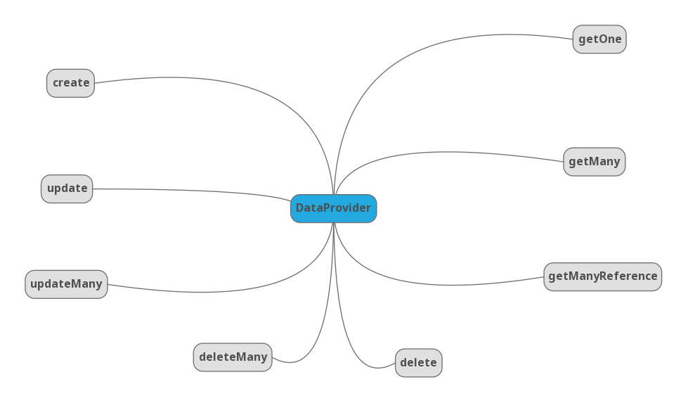

# **React Admin**

---

# **~~React~~ Admin**

---

# **Providers**

---

## Data Providers



---

## Data Providers

```js
const dataProvider = {
  getList: (resource, params) => Promise,
  getOne: (resource, params) => Promise,
  getMany: (resource, params) => Promise,
  getManyReference: (resource, params) => Promise,
  create: (resource, params) => Promise,
  update: (resource, params) => Promise,
  updateMany: (resource, params) => Promise,
  delete: (resource, params) => Promise,
  deleteMany: (resource, params) => Promise,
};
```

---


## Data Providers


[ra-data-simple-rest](https://github.com/marmelab/react-admin/tree/master/packages/ra-data-simple-rest)

[ra-data-graphql-simple](https://github.com/marmelab/react-admin/tree/master/packages/ra-data-graphql-simple)

[Available Providers](https://marmelab.com/react-admin/DataProviders.html)

---

## Auth Providers

## 

## Auth Providers

```js
const authProvider = {
  // authentication
  login: (params) => Promise.resolve(),
  checkError: (error) => Promise.resolve(),
  checkAuth: (params) => Promise.resolve(),
  logout: () => Promise.resolve(),
  getIdentity: () => Promise.resolve(),
  // authorization
  getPermissions: (params) => Promise.resolve(),
};
```

---

## Auth Providers

AWS Amplify: MrHertal/react-admin-amplify
AWS Cognito: thedistance/ra-cognito
Firebase Auth (Google, Facebook, Github etc): benwinding/react-admin-firebase

---

# **i18n**

---

# **View**

como instalar?
como criar componente?
que componentes temos disponíveis?
como fazer `fetch`?
login?
