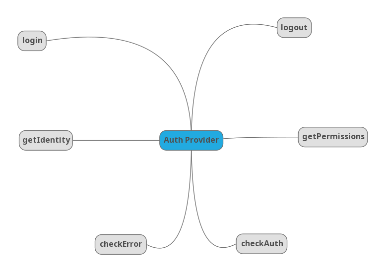

# **React Admin**


---

# Admin


---

# Admin

as propriedades do componente **Admin**


---

# **Providers**

---

# **Providers**

- DataProvider

---

# **Providers**

- DataProvider
- AuthProvider

---

# **Providers**

- DataProvider
- AuthProvider
- i18nProvider

---

## Data Providers

```js
<Admin dataProvider={CustomProvider}
```


---

## Data Providers

```js
const dataProvider = {
  getList: (resource, params) => Promise,
  getOne: (resource, params) => Promise,
  getMany: (resource, params) => Promise,
  getManyReference: (resource, params) => Promise,
  create: (resource, params) => Promise,
  update: (resource, params) => Promise,
  updateMany: (resource, params) => Promise,
  delete: (resource, params) => Promise,
  deleteMany: (resource, params) => Promise,
};
```

---


## Data Providers


[ra-data-simple-rest](https://github.com/marmelab/react-admin/tree/master/packages/ra-data-simple-rest)

[ra-data-graphql-simple](https://github.com/marmelab/react-admin/tree/master/packages/ra-data-graphql-simple)

[Available Providers](https://marmelab.com/react-admin/DataProviders.html)

---

## Auth Providers

```js
<Admin dataProvider={CustomProvider}
```



---

## Auth Providers

```js
const authProvider = {
  // authentication
  login: (params) => Promise.resolve(),
  checkError: (error) => Promise.resolve(),
  checkAuth: (params) => Promise.resolve(),
  logout: () => Promise.resolve(),
  getIdentity: () => Promise.resolve(),
  // authorization
  getPermissions: (params) => Promise.resolve(),
};
```

---

## Auth Providers

- AWS Amplify: MrHertal/react-admin-amplify
- AWS Cognito: thedistance/ra-cognito
- Firebase Auth (Google, Facebook, Github etc): benwinding/react-admin-firebase

---

## i18n Provider

```js
<Admin dataProvider={CustomProvider} />
```


---

## i18n Provider

```js
const i18nProvider = {
  translate: (key, options) => string,
  changeLocale: (locale) => Promise,
  getLocale: () => string,
};
```

---

## Exemplo

```js
const App = () => (
  <Admin
    dataProvider={dataProvider}
    authProvider={authProvider}
    i18nProvider={i18nProvider}
  />
);
```

```js
const SaveButton = ({ doSave }) => {
  const translate = useTranslate();
  return <Button onClick={doSave}>{translate("ra.action.save")}</Button>;
};
```

---

# Resources

```js
<Resource name="posts" />
```

```js
<Resource name="authors" />
```


---

# Resources

`Resource` representa uma entidade, como `Post`

```js
Post {
 id
 title
 authorId
}
```

---

# Resources

```js
<Resource name="posts" list={PostList} />
```

```js
fetch("https:/some.url/posts");
```


---

# Resources

```js
<Resource name="posts" create={PostCreate} />
```

```js
<Resource name="posts" edit={PostEdit} />
```

```js
<Resource name="posts" show={PostShow} />
```

---

# Fields

```js
<BooleanField />
```

```js
<EmailField />
```

---

## Reference Fields

```js
<ReferenceField reference="authors" />
```

```js
<ReferenceManyFields reference="comments" target="post_id" />
```

```js
<ReferenceManyToManyFields reference="authors" ... />
```

```js
<ReferenceArrayField reference="posts" source="post_ids" />
```

---

## Reference Fields

```js
fetch("https://some.url/posts/123");
```

```json
{
  "id": 123,
  "title": "React Admin",
  "authorId": 321
}
```

---

## Reference Fields

```js
<Show {...props}>
  <SimpleShowLayout>
    <TextField source="id" />
    <TextField source="title" />
    <ReferenceField reference="author" source="authorId">
      <TextField source="id" />
      <TextField source="name" />
    </ReferenceField>
    <EditButton />
  </SimpleShowLayout>
</Show>
```

---

# Others

```js
import { makeStyles } from "@material-ui/core/styles";

const useStyles = makeStyles({
  price: { color: "purple" },
});

const PriceField = (props) => {
  const classes = useStyles();
  return <TextField className={classes.price} {...props} />;
};

export const ProductList = (props) => (
...
);
<span class="[class name generated by JSS]">2</span>
```

---

# Docs

[React Admin](https://marmelab.com/react-admin/Readme.html)

Enterprise Edition


---

# Developed By


---

# Dúvidas ???


